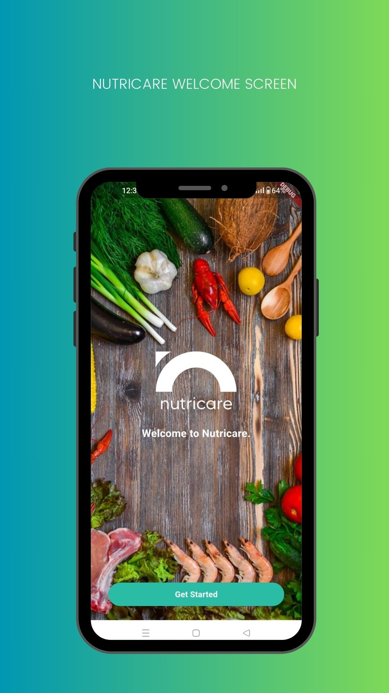
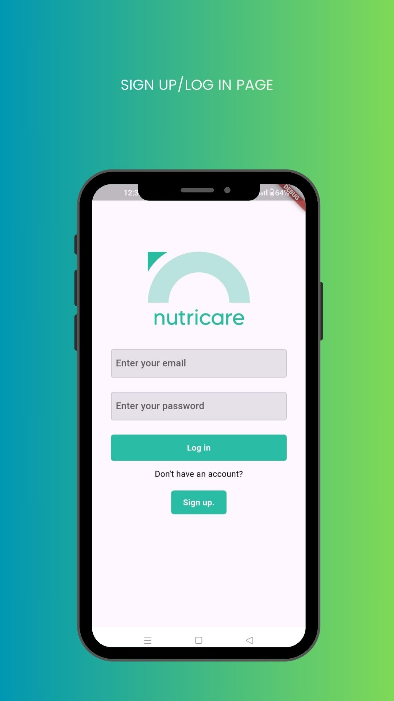
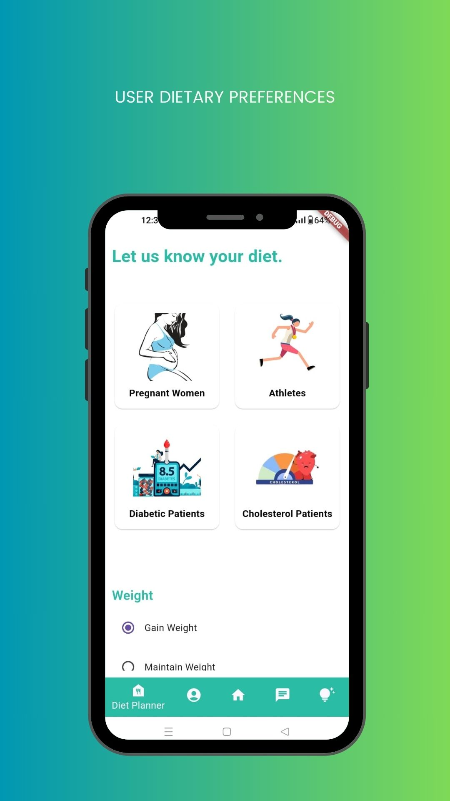
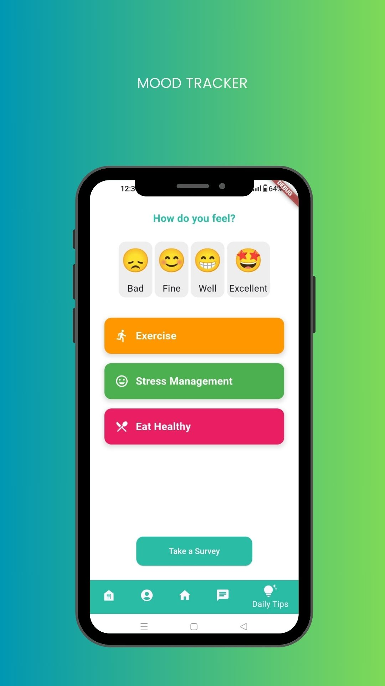
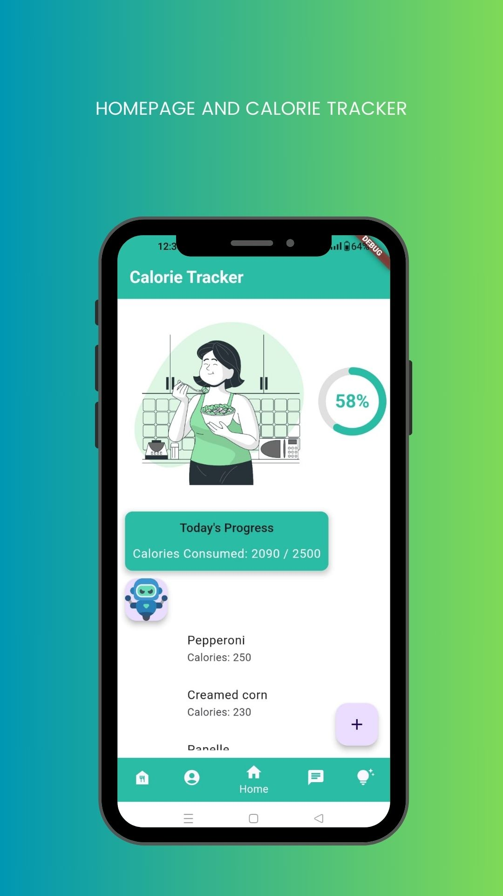
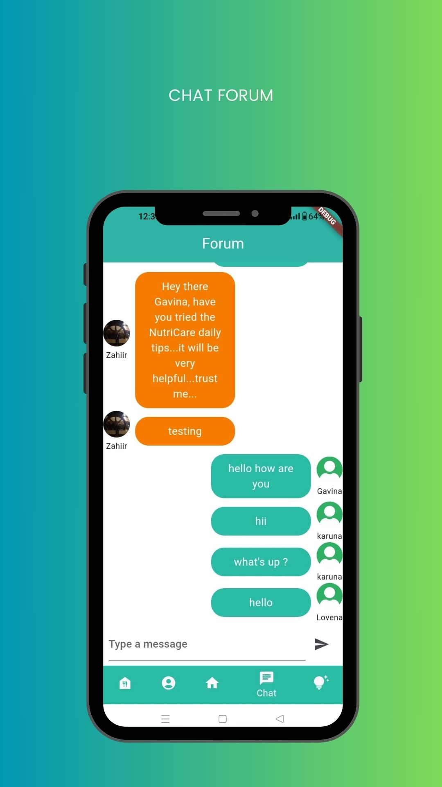
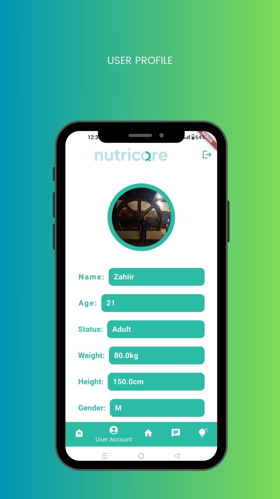
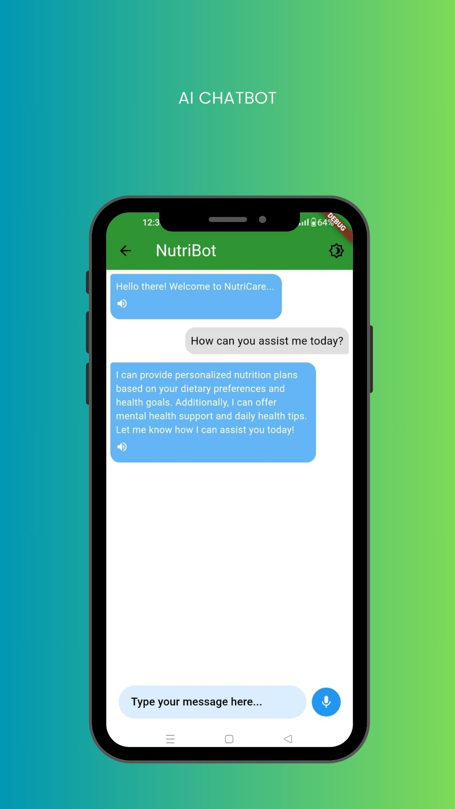

# NutriCare 🍎🥗

<div align="center">

<br>
  
Welcome to NutriCare, your ultimate AI-powered assistant for personalized dietary and mental health guidance! 🌟🤖

## Description 📄

NutriCare is designed to help users maintain a healthy lifestyle by providing culturally relevant and practical advice. Our AI assistant, NutriBot, is knowledgeable about various dietary needs and provides mental health support, daily health tips, and AI-powered diet plans. Whether you need individual advice or support for your overall well-being, NutriBot is always available to assist you with quick, accurate, and empathetic responses.

<div align="center">

<br>
</div>


### Key Features ✨

- **Personalized Meal Plans 🍽️**: Tailored dietary guidance for diabetics, pregnant women, children, and the elderly.

 <div align="center">

<br>
</div>

- **Mental Health Support 🧠**: Resources and tips to help you manage stress and maintain mental well-being.
- **Daily Health Tips 📅**: Regular advice on nutrition, exercise, and general wellness.

  <div align="center">

<br>
         
</div>

- **Nutritional Tracking 📊**: Monitor your dietary intake and get recommendations.
<div align="center">

<br>
      </div>
      
- **Cultural Relevance 🌍**: Advice and meal plans that incorporate local Mauritian dietary habits and preferences.


    
    
      

        


<div align="center">

<br>          
</div>


## How to Use 🤔

1. **Create a Profile 📝**: Enter basic information about yourself such as age, weight, dietary preferences, and health goals.
  <div align="center">

<br>          
</div>

3. **Interact with NutriBot 💬**: Ask questions and get personalized guidance on diet and mental health.

<div align="center">

<br>          
</div>

5. **Track Your Progress 📈**: Use the app’s features to monitor your dietary intake and mental well-being.

## Contributors 👥

- **Zahiir Peerbux** 🧑‍💻
  - **Role**: Team Lead
  - **Phone**: +230 5910 0627 📞
  - **Email**: [zahiirpeerbux2019@gmail.com](mailto:zahiirpeerbux2019@gmail.com) 📧
- **Beharee Smriti Gavina** 🧑‍💼
  - **Role**: Flutter Developer
- **Li Shing Hiung Li Shi Lin Meryl** 🧑‍🎨
  - **Role**: Flutter Developer
- **Joel Mappa** 🧑‍💻
  - **Role**: Flutter and Firebase Developer

## Getting Started 🚀

Follow these steps to set up the project locally:

1. **Clone the repository**:

   ```bash
   git clone https://github.com/username/NutriCare_app.git
   ```
2. **To use the AI chatbot,create a .env file in the assets directory as well as in the primary directory and assign your Gemini API key to the API_KEY variable**:

~~~
   API_KEY="<API key here>"
~~~

For more details on the project proposal, you can access the full document [here](https://drive.google.com/file/d/1C9fhYr2yK6pDJJNT-PbpZzZc80VQoM6u/view?usp=sharing).


